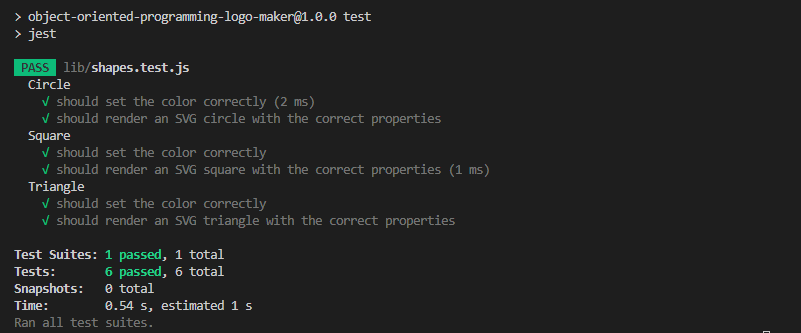

# Object-Oriented-Programming-Logo-Maker

## Challenge Description
This application allows users to generate a logo "logo.svg" file by entering inputs into an inquirer prompt. The logo.svg file contains the user's results as an SVG image. 

## Technologies Used

* Node.JS
* JavaScript
* Object-Oriented Programming (OOP)
* Jest
* Inquirer

## Installation Process
1. Clone the Repository
2. Open integrated terminal on index.js
* Make sure you have the following installed: 
- NodeJS
- Jest
- Inquirer.js
3. Enter "node index.js" in the terminal
4. You will be presented with 3 prompts, input your answers in the terminal
5. Once prompts have been completed successfully, then a message will say the logo has been generated successfully
6. A SVG file named logo.svg will be created
- You may rename the SVG File
- To view the Logo, copy the code into a text editor and save as .svg or drag and drop in your browser URL 

## User Story

```md
AS a freelance web developer
I WANT to generate a simple logo for my projects
SO THAT I don't have to pay a graphic designer
```

## Acceptance Criteria

```md
GIVEN a command-line application that accepts user input
WHEN I am prompted for text
THEN I can enter up to three characters
WHEN I am prompted for the text color
THEN I can enter a color keyword (OR a hexadecimal number)
WHEN I am prompted for a shape
THEN I am presented with a list of shapes to choose from: circle, triangle, and square
WHEN I am prompted for the shape's color
THEN I can enter a color keyword (OR a hexadecimal number)
WHEN I have entered input for all the prompts
THEN an SVG file is created named `logo.svg`
AND the output text "Generated logo.svg" is printed in the command line
WHEN I open the `logo.svg` file in a browser
THEN I am shown a 300x200 pixel image that matches the criteria I entered
```

## Demo screenshots:
# Command Line Application


# Jest Case Testing


# Generated Logo


## Walkthrough Video Link

https://drive.google.com/file/d/1P5-Q6v6H0vE_O9f5wfpTmYYyLXmGjeqL/view

## Link to GitHub Repository
https://github.com/Saria995/Object-Oriented-Programming-Logo-Maker.git 
